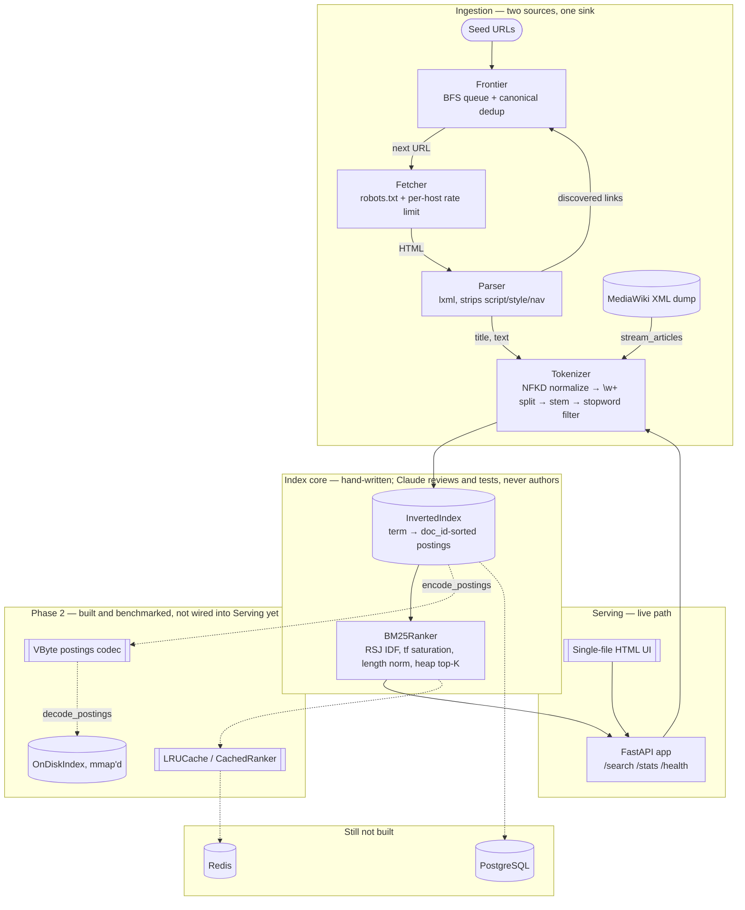
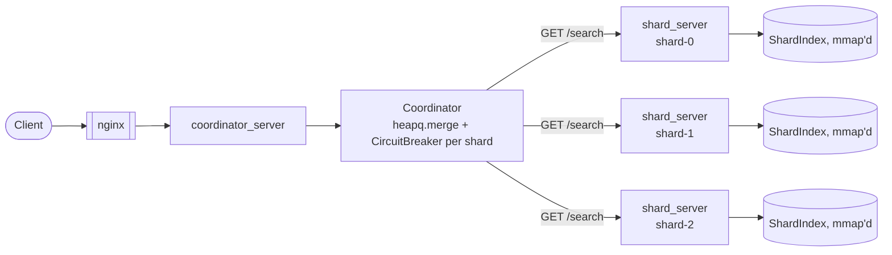

# distributed-search-engine


A search engine built from scratch to be defensible in an interview: the
tokenizer, inverted index, BM25 ranker, and the crawler that feeds them are
hand-written, not assembled from a library that does the information-retrieval
thinking for you. See [CLAUDE.md](CLAUDE.md) for the full constraint set.

## Architecture



`search/api` is a working FastAPI service (`GET /search`, `/stats`, `/health`,
plus the single-file HTML UI at `/`) that builds the in-memory index once at
startup via a lifespan handler and never rebuilds it per request.
`search/cache` and the on-disk mmap'd index (`search/storage/ondisk.py`)
exist as built, independently-benchmarked components — see Phase 2 below —
but neither is wired into the live API yet: `/search` still calls
`BM25Ranker` directly against the in-memory index. PostgreSQL and Redis
remain declared in the stack but unconnected to anything.

## Stack

Python 3.14, FastAPI, PostgreSQL, Redis, Docker Compose, pytest, hypothesis.
No Elasticsearch, Whoosh, rank_bm25, nltk, or sklearn — every IR data
structure here is hand-written.

## Setup

```powershell
python -m venv venv
venv\Scripts\Activate.ps1
pip install -r requirements.txt
```

Run the test suite:

```powershell
pytest
```

(`pytest.ini` puts `src` on the path for you. For ad hoc scripts outside
pytest, set `$env:PYTHONPATH="src"` first.)

## Usage

```python
from search.index.inverted_index import InvertedIndex
from search.ranking.bm25 import BM25Ranker

index = InvertedIndex()
index.add_document(1, "distributed systems are running", title="Distributed Systems")
index.add_document(2, "distributed caches and running systems", title="Caching")

ranker = BM25Ranker(index)
for doc_id, score in ranker.search("distributed caching", top_k=5):
    print(score, index.document(doc_id).title)
```

For crawling instead of loading a static corpus:

```python
from search.crawler.crawler import crawl
from search.index.inverted_index import InvertedIndex

index = InvertedIndex()
stats = crawl(["https://example.com"], index, max_pages=100, max_depth=3)
```

Loading a Wikipedia dump (used by the benchmark harness) expects a
bz2-compressed MediaWiki XML export, e.g. a Simple English Wikipedia dump
from dumps.wikimedia.org, at `data/dumps/simplewiki.xml.bz2`.

## Benchmarks

Measured with `python benchmarks/bench_index.py`, which builds each corpus
size from `data/dumps/simplewiki.xml.bz2` in its own subprocess (a fresh
process per size avoids CPython holding onto freed arenas and making later
sizes look artificially cheap), then issues 300 BM25 queries (article titles,
20 discarded as warm-up) per size.

| docs | build_seconds | docs/sec | vocab | avgdl | index_mb | kb/doc | p50_ms | p95_ms | p99_ms |
|---|---|---|---|---|---|---|---|---|---|
| 5,000 | 20.9 | 239 | 120,481 | 668 | 138.4 | 28.3 | 0.28 | 2.16 | 2.85 |
| 10,000 | 31.5 | 318 | 159,455 | 503 | 209.5 | 21.5 | 0.35 | 4.66 | 9.81 |
| 20,000 | 51.9 | 385 | 221,482 | 403 | 335.8 | 17.2 | 0.43 | 5.75 | 10.82 |
| 50,000 | 101.0 | 495 | 386,888 | 344 | 693.0 | 14.2 | 0.64 | 18.94 | 39.16 |
| 100,000 | 234.3 | 427 | 564,703 | 285 | 1,154.2 | 11.8 | 1.53 | 32.41 | 107.36 |

The 5K–20K rows and the 50K–100K rows come from separate runs — treat
cross-boundary comparisons (e.g. the docs/sec dip at 100K) as directional,
not as a controlled A/B.

## Findings

### Heaps' law, confirmed empirically

Vocabulary growth is sublinear in document count, as Heaps' law predicts.
Fitting `V = K·N^b` across the full range (5K → 100K, a 20x increase in docs
against a 4.7x increase in vocabulary) gives `b ≈ 0.52`; the per-interval
exponents (0.40, 0.47, 0.61, 0.55 across the four consecutive size doublings)
cluster around the same value and sit inside the canonical 0.4–0.6 band
reported for natural-language corpora.

The same sublinearity shows up downstream: total index memory grew only
~8.3x (138.4MB → 1,154.2MB) against a 20x increase in docs, and `kb_per_doc`
fell monotonically from 28.3 to 11.8. Each new document costs less marginal
index space as more of its terms already exist in the vocabulary. Part of
that decline is corpus-specific rather than a pure Heaps'-law effect, though:
`avgdl` itself falls from 668 to 285 across the same range, meaning documents
later in the dump's stream order are shorter on average — that alone would
shrink `kb_per_doc` even if vocabulary growth were perfectly linear.

### p99 degrades 38x while p50 grows 5.5x

- p50: 0.28ms → 1.53ms, a 5.5x increase over a 20x growth in corpus size.
- p95: 2.16ms → 32.41ms, ~15x.
- p99: 2.85ms → 107.36ms, ~37.7x.

`BM25Ranker.search` (`src/search/ranking/bm25.py`) touches every doc in every
query term's postings list, by design — "only documents in a postings list
are ever touched" is the entire point of an inverted index. Most queries hit
terms with low-to-mid document frequency, and those postings lists grow
sublinearly for the same Heaps'-law reason vocabulary does, so the median
query stays cheap. But a query that includes even one high-frequency
non-stopword term (stopwords are filtered, but plenty of common words
survive — "history", "world", "system") pays for a postings list whose
length scales close to linearly with `document_count`. Those queries are the
p95/p99 tail, and their cost scales with total corpus size, not with query
complexity — which is why the tail degrades far faster than the median as
the corpus grows.

That's what motivated caching and sharding as the next two pieces to build:

- **Caching** — the same small set of high-df terms recurs across many
  queries; memoizing `document_frequency`/IDF, or caching hot query results
  outright, removes repeated full postings walks for exactly the terms
  driving the tail. Built and measured in Phase 2 below — and the result
  complicates this prediction: caching helps the median far more than it
  helps the tail.
- **Sharding** — splitting the corpus across N shards bounds worst-case
  postings length to roughly `total_df / N` per shard instead of letting it
  grow with the whole corpus, which is what keeps p99 from scaling with
  corpus size indefinitely. `InvertedIndex`'s own docstring already flags
  frequency-sorted postings and WAND-style early termination as the next
  lever if sharding alone isn't enough.

### The index-page ranking pathology

Long, link-farm-style pages that weakly mention nearly every topic once
out-rank the pages that actually answer the query.

Concrete example: on a 100-page crawl of docs.python.org, the queries "hash
table", "asynchronous io", and "regular expressions" all put "The Python
Standard Library" and "Python Module Index" in the top 3 — the actual `re`
and `asyncio` module pages never appeared. On the Wikipedia 5K corpus,
"distributed machine learning" ranked "List of Disney movies" at #5.

Cause: an index/list page is a long page that mentions a huge number of
distinct terms at `tf=1` each. BM25's length normalization (`b=0.75` in
`src/search/ranking/bm25.py`) discounts long documents, but not enough to
offset how many distinct queries a link farm can weakly match — every query
term the page contains contributes `idf * weight` regardless of how thin
that single mention is, so a page that weakly matches all of a query's terms
can out-accumulate a page that strongly matches only some of them.

Mitigation identified but not implemented: link-to-text ratio filtering in
`src/search/crawler/parser.py`. A page that's structurally mostly `<a>` tags
relative to prose is an index/list page regardless of its content, and could
be filtered or down-weighted before indexing rather than patched at ranking
time.

### Exact-title matches degrade as the corpus grows

The query "solar system" returns the "Solar System" article at rank 4 on
the 20K corpus. On the 100K corpus, run against the same ranker, it does not
appear in the top 10 at all — crowded out by "Solar power"/"Solar energy"
articles, several of which score within 0.7 of each other.

Cause: `BM25Ranker` (`src/search/ranking/bm25.py`) scores title and body
text identically — there's no field weighting, so a term appearing in the
title carries exactly as much weight as the same term appearing once in
running body text. A query that's *literally the title of the best answer*
gets no credit for that. This doesn't show up at small corpus sizes because
there are few enough competing documents that the right one still clears the
bar; it degrades specifically as corpus size grows, because a bigger corpus
supplies more documents that mention "solar" and "system"/"power"/"energy"
somewhere in their body text at a similar term frequency — more weak
competitors bunched at a similar score, any of which can outrank the exact
match once enough of them exist.

The standard remedy is BM25F: score title and body as separate fields with
independent weights, so a title hit outweighs an equivalent body hit rather
than tying with it. Not implemented — like the index-page pathology above,
this is a ranking-model gap rather than a bug in the existing implementation
of the model it does have.

### The stemmer's documented collisions

`_stem` (`src/search/index/tokenizer.py`) can collapse two unrelated words
onto the same term when one is a derivational match for the other's suffix
rule. `"organ"` and `"organization"` both reduce to `"organ"` —
`"organization"` matches the `"ization"` suffix rule and strips down to
exactly the literal word `"organ"`. A body part and a corporate structure
end up sharing one postings list.

This is a known, accepted tradeoff of the suffix-stripping design, not an
oversight: the module's own docstring defines correctness as "agreement, not
linguistic accuracy" — every inflection of a word must collapse to one term,
but the term need not be a real word, and nothing guarantees it won't also
be the correct stem of some unrelated word. Recorded here as a documented
limitation per the project's review-not-rewrite division of labor, not
something patched silently.

## Phase 2: cache, codec, on-disk index

Three components built on top of the Phase 1 core, each independently
benchmarked (`benchmarks/bench_cache.py`, `bench_codec.py`, `bench_ondisk.py`)
against the 20K-document corpus. None is wired into `search/api` yet — these
numbers describe the components in isolation, not the live service.

### LRU query cache

`CachedRanker` (`src/search/ranking/cached_ranker.py`) wraps `BM25Ranker`
with `LRUCache` (`src/search/cache/lru.py`), keyed on the normalized
`(query, top_k)` pair. Measured against a Zipfian query distribution — a
handful of queries account for most traffic, a long tail is seen once or
rarely — over 2,000 trials:

| capacity | hit rate | p50 | p95 | p99 |
|---|---|---|---|---|
| 50 | 66.7% | 0.001 ms | 1.833 ms | 4.185 ms |
| 256 | 90.7% | 0.001 ms | 0.170 ms | 2.325 ms |

Uncached baseline: p50 0.273 ms, p95 4.067 ms, p99 6.149 ms.

**Finding: caching collapses the median but barely moves the tail, because
p99 is dominated by misses.** The Zipfian head — a small number of distinct
queries — is what makes p50 nearly free (0.001 ms) at even a 50-entry
cache. But p99 is drawn from the distribution's long tail: queries the
cache has never seen, which still pay the full uncached `BM25Ranker` cost
regardless of capacity. Growing the cache from 50 to 256 entries lifts the
hit rate and does pull p99 down (4.185 ms → 2.325 ms), but only by admitting
more of the tail into cache coverage — a genuine miss is exactly as
expensive at capacity 256 as at capacity 50. A cache makes the worst case
rarer, not faster.

### VByte delta-encoded postings

`src/search/index/codec.py` sorts postings by `doc_id` (an invariant
`InvertedIndex` already guarantees), stores gaps between consecutive ids
instead of absolute ids, and packs each gap and term frequency as a
variable-byte integer — 7 data bits per byte, high bit as a continuation
flag, so any gap under 128 fits in one byte. Across the 20K-doc corpus's
4.1M postings:

**4.01 bytes/posting packed, versus ~64 bytes for a `(doc_id, tf)` tuple in
a Python list** — roughly 16x smaller. The saving is entirely object
overhead: a Python tuple of two ints costs pointers, type headers, and
per-object allocation for 8 bytes of actual data; a packed byte string pays
close to only for the data itself.

### On-disk mmap'd index

`OnDiskIndexWriter`/`OnDiskIndex` (`src/search/storage/ondisk.py`) serialize
postings into one contiguous VByte-encoded blob and serve it via
`mmap`, so the OS pages in only the slices a query actually touches instead
of the process holding every posting resident:

| mode | resident | load | p50 | p95 | p99 |
|---|---|---|---|---|---|
| in-memory | 334.9 MB | 31.4 s | 0.305 ms | 3.777 ms | 11.202 ms |
| on-disk | 52.9 MB | 0.27 s | 0.525 ms | 4.187 ms | 11.164 ms |

**Finding: 0.22 ms added to the median buys 6.3x less resident memory and a
116x faster load.** The median slows because varint decoding is fixed
per-fetch overhead — `decode_postings` now runs on every `postings()` call
instead of returning an already-resident Python list — and that cost is
visible precisely because 0.3 ms is a small enough baseline for a
fixed overhead to show up in. p99 is effectively unchanged (11.202 ms vs.
11.164 ms) because the tail is CPU-bound on BM25 scoring across long
postings lists, not on fetching them — the decode cost that dominates p50
is noise next to that.

## Phase 3: sharded cluster over Docker Compose

Everything in this section is measured against the actual running stack —
3 shard containers, a coordinator, and nginx (`docker-compose.yml`), serving
the 30K-document corpus in `data/cluster30k` — not simulated.



### Consistent hash ring: virtual-node balance

`ConsistentHashRing` (`src/search/distribution/consistent_hash.py`) partitions
30,000 document keys across 3 shards. Max deviation from a fair 1/3 share, by
virtual-node replica count:

| replicas | max deviation from fair share |
|---|---|
| 1 | 35.6% |
| 10 | 30.5% |
| 50 | 14.6% |
| 150 | 11.8% |
| 500 | 6.1% |
| 1000 | 0.8% |

The ring's default (`replicas=1000`) was set from this curve, not guessed —
imbalance keeps falling as replica count grows, and 1000 is where it flattens
out under 1%. On the real corpus this held up outside simulation too: the
actual partition landed at 10,072 / 10,009 / 9,919 documents — a 1.5% spread
between the largest and smallest shard.

### Correctness: bit-identical scores across shards

Sharded rankings match single-node ranking exactly — score delta `0.0`, not
just "close" — across every query tested. This holds because `document_frequency`,
`document_count`, and `avgdl` are computed once over the *whole* corpus at
build time and shipped into every shard (`shard_builder.py`), and `ShardIndex`
serves those global values instead of its own local ones (`shard_index.py`).
BM25 is only comparable across shards if every shard's IDF and length
normalization agree on what "the corpus" is.

That this matters is easy to demonstrate by looking at what each shard would
say on its own: shard-0 saw "solar" in 1.34% of its local documents, shard-2
in 1.51%. Ranking off shard-local IDF instead of global IDF would silently
diverge shard-to-shard — every shard would be scoring against a different,
slightly wrong idea of how rare a term is.

### Failure behavior: the circuit breaker in practice

Shard-1 stopped, all other conditions held constant:

| state | latency |
|---|---|
| healthy, 3 shards | 25 ms |
| shard down, breaker closed | 3208–3604 ms |
| shard down, breaker open | 4.1–4.5 ms |

Once the breaker opens, a query that would otherwise cost over 3 seconds
costs under 5 milliseconds — the whole point of skipping a known-dead shard
instead of re-discovering it's dead on every request.

### Finding: the 3.2s hang is Docker DNS resolution, not the connect timeout

`SHARD_CONNECT_TIMEOUT=0.2` does not bound this delay, and the reason is
mechanical rather than a misconfigured value: measured directly inside the
coordinator container, a bare `httpx.get(..., timeout=httpx.Timeout(connect=0.2))`
against a stopped shard's hostname raised `ConnectError` only after 4.073s.
Name resolution — Docker's embedded DNS resolving `shard-1` to an address —
happens *before* httpx starts its connect budget; httpx's `connect` timeout
only governs the TCP handshake once it has an address to dial, not how long
resolving the name itself is allowed to take. Lowering the timeout further
would do nothing, because the timeout was never the thing on the clock during
the slow part.

This is exactly why the circuit breaker is described as the fix and not a
shorter timeout in the previous change: it doesn't shrink the cost of one
doomed request, it stops paying that cost repeatedly. The timeout bounds a
request; the breaker bounds how many times you make one.

### Known limitation: a time-of-check-to-time-of-use gap in the breaker

With `BREAKER_FAILURE_THRESHOLD=1`, the breaker was measured opening only
after 2 consecutive failures, not 1. The cause is a race, not a bug in the
state machine itself: `Coordinator.search()` scatters to all shards in
parallel and each request only calls `record_failure()` on completion — after
its own full connect-then-DNS hang. If a second `search()` call arrives while
the first request to the down shard is still in flight, it calls
`breaker.allow_request()`, sees the breaker still `closed` (the first
failure hasn't been recorded yet because that request hasn't finished), and
dispatches its own doomed request. Both eventually fail and both record a
failure, so the breaker opens on the 2nd recorded failure regardless of the
configured threshold of 1.

`CircuitBreaker` itself is not wrong here — every transition it makes is
correct given what it's been told. What's missing is anything upstream
tracking *in-flight* requests per shard, so a second caller arriving mid-hang
would wait on (or be told about) the first request's outcome instead of
independently starting a second one. The fix would be capping concurrent
in-flight requests per shard endpoint — effectively a bulkhead in front of
the breaker. Not implemented.
