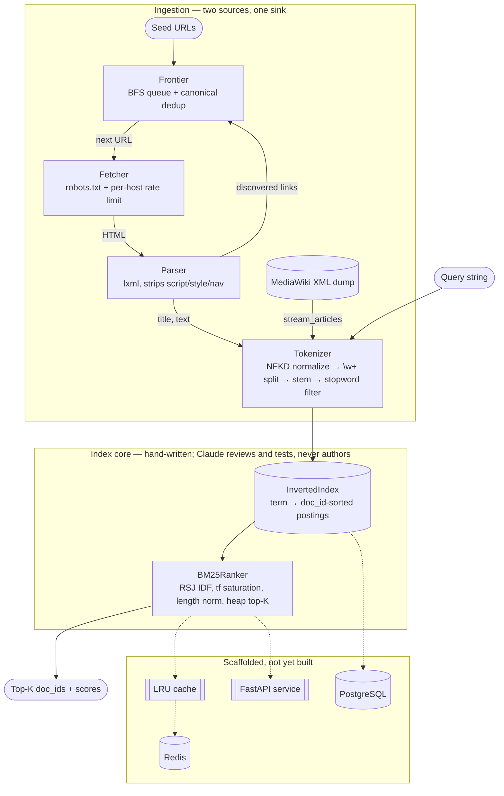

# distributed-search-engine


A search engine built from scratch to be defensible in an interview: the
tokenizer, inverted index, BM25 ranker, and the crawler that feeds them are
hand-written, not assembled from a library that does the information-retrieval
thinking for you. See [CLAUDE.md](CLAUDE.md) for the full constraint set.

## Architecture



`search/cache` and `search/api` exist as empty packages — scaffolded for
where a query cache and a FastAPI service layer go, not implemented yet.
PostgreSQL and Redis are declared in the stack but nothing wires them to the
index today; the current system runs entirely in-process, in memory.

## Stack

Python 3.14, FastAPI, PostgreSQL, Redis, Docker Compose, pytest, hypothesis.
No Elasticsearch, Whoosh, rank_bm25, nltk, or sklearn — every IR data
structure here is hand-written.

## Setup

```powershell
python -m venv venv
venv\Scripts\Activate.ps1
pip install -r requirements.txt
```

Run the test suite:

```powershell
pytest
```

(`pytest.ini` puts `src` on the path for you. For ad hoc scripts outside
pytest, set `$env:PYTHONPATH="src"` first.)

## Usage

```python
from search.index.inverted_index import InvertedIndex
from search.ranking.bm25 import BM25Ranker

index = InvertedIndex()
index.add_document(1, "distributed systems are running", title="Distributed Systems")
index.add_document(2, "distributed caches and running systems", title="Caching")

ranker = BM25Ranker(index)
for doc_id, score in ranker.search("distributed caching", top_k=5):
    print(score, index.document(doc_id).title)
```

For crawling instead of loading a static corpus:

```python
from search.crawler.crawler import crawl
from search.index.inverted_index import InvertedIndex

index = InvertedIndex()
stats = crawl(["https://example.com"], index, max_pages=100, max_depth=3)
```

Loading a Wikipedia dump (used by the benchmark harness) expects a
bz2-compressed MediaWiki XML export, e.g. a Simple English Wikipedia dump
from dumps.wikimedia.org, at `data/dumps/simplewiki.xml.bz2`.

## Benchmarks

Measured with `python benchmarks/bench_index.py`, which builds each corpus
size from `data/dumps/simplewiki.xml.bz2` in its own subprocess (a fresh
process per size avoids CPython holding onto freed arenas and making later
sizes look artificially cheap), then issues 300 BM25 queries (article titles,
20 discarded as warm-up) per size.

| docs | build_seconds | docs/sec | vocab | avgdl | index_mb | kb/doc | p50_ms | p95_ms | p99_ms |
|---|---|---|---|---|---|---|---|---|---|
| 5,000 | 20.9 | 239 | 120,481 | 668 | 138.4 | 28.3 | 0.28 | 2.16 | 2.85 |
| 10,000 | 31.5 | 318 | 159,455 | 503 | 209.5 | 21.5 | 0.35 | 4.66 | 9.81 |
| 20,000 | 51.9 | 385 | 221,482 | 403 | 335.8 | 17.2 | 0.43 | 5.75 | 10.82 |
| 50,000 | 101.0 | 495 | 386,888 | 344 | 693.0 | 14.2 | 0.64 | 18.94 | 39.16 |
| 100,000 | 234.3 | 427 | 564,703 | 285 | 1,154.2 | 11.8 | 1.53 | 32.41 | 107.36 |

The 5K–20K rows and the 50K–100K rows come from separate runs — treat
cross-boundary comparisons (e.g. the docs/sec dip at 100K) as directional,
not as a controlled A/B.

## Findings

### Heaps' law, confirmed empirically

Vocabulary growth is sublinear in document count, as Heaps' law predicts.
Fitting `V = K·N^b` across the full range (5K → 100K, a 20x increase in docs
against a 4.7x increase in vocabulary) gives `b ≈ 0.52`; the per-interval
exponents (0.40, 0.47, 0.61, 0.55 across the four consecutive size doublings)
cluster around the same value and sit inside the canonical 0.4–0.6 band
reported for natural-language corpora.

The same sublinearity shows up downstream: total index memory grew only
~8.3x (138.4MB → 1,154.2MB) against a 20x increase in docs, and `kb_per_doc`
fell monotonically from 28.3 to 11.8. Each new document costs less marginal
index space as more of its terms already exist in the vocabulary. Part of
that decline is corpus-specific rather than a pure Heaps'-law effect, though:
`avgdl` itself falls from 668 to 285 across the same range, meaning documents
later in the dump's stream order are shorter on average — that alone would
shrink `kb_per_doc` even if vocabulary growth were perfectly linear.

### p99 degrades 38x while p50 grows 5.5x

- p50: 0.28ms → 1.53ms, a 5.5x increase over a 20x growth in corpus size.
- p95: 2.16ms → 32.41ms, ~15x.
- p99: 2.85ms → 107.36ms, ~37.7x.

`BM25Ranker.search` (`src/search/ranking/bm25.py`) touches every doc in every
query term's postings list, by design — "only documents in a postings list
are ever touched" is the entire point of an inverted index. Most queries hit
terms with low-to-mid document frequency, and those postings lists grow
sublinearly for the same Heaps'-law reason vocabulary does, so the median
query stays cheap. But a query that includes even one high-frequency
non-stopword term (stopwords are filtered, but plenty of common words
survive — "history", "world", "system") pays for a postings list whose
length scales close to linearly with `document_count`. Those queries are the
p95/p99 tail, and their cost scales with total corpus size, not with query
complexity — which is why the tail degrades far faster than the median as
the corpus grows.

That's what motivates the two unimplemented pieces in the architecture
diagram:

- **Caching** — the same small set of high-df terms recurs across many
  queries; memoizing `document_frequency`/IDF, or caching hot query results
  outright, removes repeated full postings walks for exactly the terms
  driving the tail. This is what `src/search/cache` is scaffolded for.
- **Sharding** — splitting the corpus across N shards bounds worst-case
  postings length to roughly `total_df / N` per shard instead of letting it
  grow with the whole corpus, which is what keeps p99 from scaling with
  corpus size indefinitely. `InvertedIndex`'s own docstring already flags
  frequency-sorted postings and WAND-style early termination as the next
  lever if sharding alone isn't enough.

### The index-page ranking pathology

Long, link-farm-style pages that weakly mention nearly every topic once
out-rank the pages that actually answer the query.

Concrete example: on a 100-page crawl of docs.python.org, the queries "hash
table", "asynchronous io", and "regular expressions" all put "The Python
Standard Library" and "Python Module Index" in the top 3 — the actual `re`
and `asyncio` module pages never appeared. On the Wikipedia 5K corpus,
"distributed machine learning" ranked "List of Disney movies" at #5.

Cause: an index/list page is a long page that mentions a huge number of
distinct terms at `tf=1` each. BM25's length normalization (`b=0.75` in
`src/search/ranking/bm25.py`) discounts long documents, but not enough to
offset how many distinct queries a link farm can weakly match — every query
term the page contains contributes `idf * weight` regardless of how thin
that single mention is, so a page that weakly matches all of a query's terms
can out-accumulate a page that strongly matches only some of them.

Mitigation identified but not implemented: link-to-text ratio filtering in
`src/search/crawler/parser.py`. A page that's structurally mostly `<a>` tags
relative to prose is an index/list page regardless of its content, and could
be filtered or down-weighted before indexing rather than patched at ranking
time.

### The stemmer's documented collisions

`_stem` (`src/search/index/tokenizer.py`) can collapse two unrelated words
onto the same term when one is a derivational match for the other's suffix
rule. `"organ"` and `"organization"` both reduce to `"organ"` —
`"organization"` matches the `"ization"` suffix rule and strips down to
exactly the literal word `"organ"`. A body part and a corporate structure
end up sharing one postings list.

This is a known, accepted tradeoff of the suffix-stripping design, not an
oversight: the module's own docstring defines correctness as "agreement, not
linguistic accuracy" — every inflection of a word must collapse to one term,
but the term need not be a real word, and nothing guarantees it won't also
be the correct stem of some unrelated word. Recorded here as a documented
limitation per the project's review-not-rewrite division of labor, not
something patched silently.
